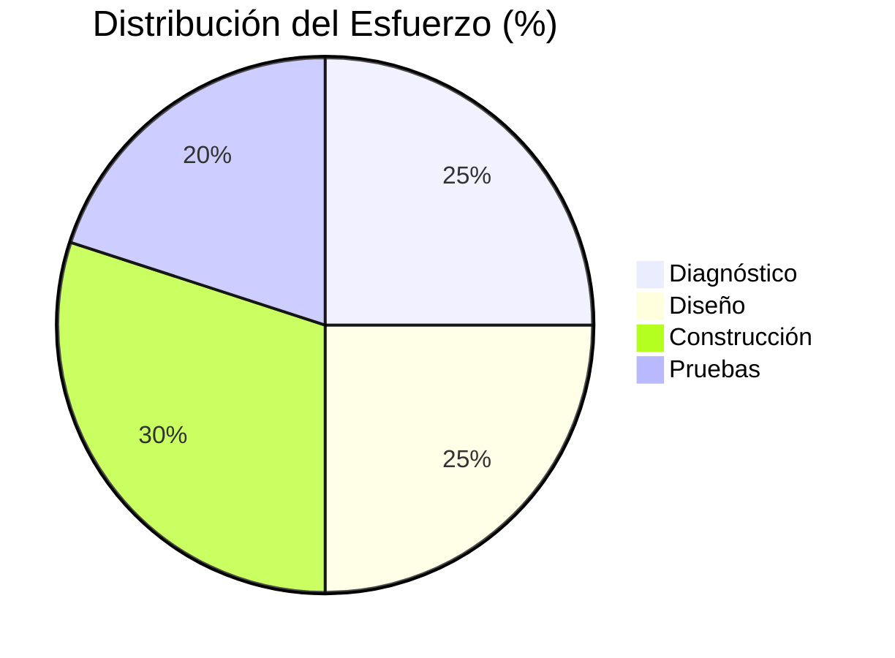

<!-- Slide 1: Portada Principal con Membrete Oficial y Estilo Canva / UNEG -->

<svg class="absolute inset-0 w-full h-full pointer-events-none z-0" viewBox="0 0 980 550" preserveAspectRatio="none" fill="none" xmlns="http://www.w3.org/2000/svg">
  <path d="M 640 0 C 700 90, 770 140, 980 180 L 980 0 Z" fill="#97c8eb" />
  <path d="M 760 0 C 790 70, 840 105, 980 140 L 980 0 Z" fill="#1b4d89" />
  <path d="M 0 320 C 60 350, 110 410, 150 470 C 180 515, 230 535, 300 550 L 0 550 Z" fill="#97c8eb" />
  <path d="M 0 460 C 60 465, 110 500, 150 550 L 0 550 Z" fill="#3b77a8" />
  <path d="M 0 480 C 40 480, 80 515, 100 550 L 0 550 Z" fill="#1b4d89" />
  <circle cx="518" cy="38" r="6.5" fill="#97c8eb" />
  <circle cx="616" cy="46" r="10" fill="#1b4d89" />
  <circle cx="835" cy="128" r="6" fill="#97c8eb" />
  <circle cx="968" cy="225" r="7.5" fill="#1b4d89" />
  <circle cx="32" cy="320" r="8" fill="#1b4d89" />
  <circle cx="120" cy="445" r="5.5" fill="#97c8eb" />
  <circle cx="370" cy="505" r="9" fill="#1b4d89" />
  <circle cx="470" cy="518" r="5.5" fill="#97c8eb" />
</svg>

  
  

    UNIVERSIDAD NACIONAL EXPERIMENTAL DE GUAYANA
    VICERRECTORADO ACADÉMICO
    COORDINACIÓN GENERAL DE PREGRADO
    PROYECTO DE CARRERA: INGENIERÍA EN INFORMÁTICA
  

  

    SISTEMA PROVEEDOR DE IDENTIDAD (IDP) CIBERFÍSICO BASADO EN 
    AUTENTICACIÓN BIOMÉTRICA FACIAL ANTI-SPOOFING Y REGISTRO 
    INMUTABLE EN BLOCKCHAIN PARA LA GESTIÓN UNIFICADA DE CONTROL DE ACCESO
  

  

    

      Tutor academico
      Ing. Livia Borjas
      C.I: V-10.928.181
    

    

      Ciudad Guayana, Septiembre 2026.
    

    

      Autor:
      Br. Héctor Tovar
      C.I: V-30.335.783
    

  

<!-- 
Buenas tardes a los honorables miembros del jurado y tutora. Hoy presento el resultado de mi Trabajo de Grado titulado SISTEMA PROVEEDOR DE IDENTIDAD (IDP) CIBERFÍSICO BASADO EN AUTENTICACIÓN BIOMÉTRICA FACIAL ANTI-SPOOFING Y REGISTRO INMUTABLE EN BLOCKCHAIN PARA LA GESTIÓN UNIFICADA DE CONTROL DE ACCESO, una solución diseñada para modernizar la infraestructura de seguridad lógica y física.
-->

---
layout: default
title: "Introducción al Escenario"
---

<!-- Slide 2: Introducción -->

Contexto
02 / 19

<h1 class="text-3xl font-extrabold text-slate-900">Introducción al Escenario Actual</h1>

Desconexión crítica entre accesos físicos y seguridad lógica.

<carbon:password class="text-2xl" />

<h3 class="text-base font-bold text-slate-900 mb-1">Sistemas Vulnerables</h3>
Contraseñas y Carnets

Credenciales compartidas y tarjetas clonables sin confirmación identitaria real.

<carbon:face-mask class="text-2xl" />

<h3 class="text-base font-bold text-slate-900 mb-1">El Reto Biométrico</h3>
Ataques de Spoofing

Suplantación mediante fotos impresas, pantallas 2D o reproducción de videos.

<carbon:security class="text-2xl" />

<h3 class="text-base font-bold text-slate-900 mb-1">Solución FaceSentinel</h3>
IdP Ciberfísico

Unificación de Edge Computing, Inteligencia Artificial y Registro Blockchain.

🔒 Paradigma Zero-Trust
⚡ Procesamiento Perimetral
⛓️ Trazabilidad Criptográfica Inmutable

<!-- 
La seguridad en los entornos institucionales está fragmentada en silos. El acceso físico depende de tarjetas clonables y cámaras pasivas, mientras que el lógico depende de contraseñas vulnerables. Aunque la biometría facial resuelve parte del problema, introduce el riesgo de ataques de suplantación. Este proyecto nace para unificar y blindar ambos mundos.
-->

---
layout: center
class: text-center
title: "Capítulo I: El Problema"
---

<!-- Slide 3: Capítulo I Separator -->

Diagnóstico

<h1 class="text-5xl font-black text-slate-900 tracking-tight mb-2">
CAPÍTULO I
</h1>

<h2 class="text-xl font-bold text-sky-800">
EL PROBLEMA Y JUSTIFICACIÓN
</h2>

<!-- 
(Transición al Capítulo I)
-->

---
layout: default
title: "Planteamiento del Problema"
---

<!-- Slide 4: El Problema -->

Diagnóstico
04 / 19

<h1 class="text-3xl font-extrabold text-slate-900">El Problema</h1>

Puntos críticos en los esquemas de seguridad convencionales.

<carbon:identification class="text-2xl" />

<h3 class="text-base font-bold text-slate-900 m-0">Credenciales Inseguras</h3>
Suplantación Física

Préstamo de tarjetas, carnets extraviados y ausencia de verificación biométrica en vivo.

<carbon:video class="text-2xl" />

<h3 class="text-base font-bold text-slate-900 m-0">Vigilancia CCTV Pasiva</h3>
Sin Inteligencia

Cámaras que solo graban para análisis forense post-evento sin capacidad de acción preventiva.

<carbon:data-base class="text-2xl" />

<h3 class="text-base font-bold text-slate-900 m-0">Bitácoras Centralizadas (SPOF)</h3>
Riesgo de Datos

Bases de datos manipulables internamente y vulnerables a caídas de red total.

Diagnóstico operacional en entornos universitarios y corporativos

<!-- 
El problema radica en que los controles físicos actúan como barreras aisladas, las cámaras solo sirven como registro forense post-incidente, y las bitácoras tradicionales son puntos únicos de falla que pueden ser manipulados desde adentro de la institución.
-->

---
layout: two-cols
title: "Objetivos del Proyecto"
---

<!-- Slide 5: Objetivos del Proyecto -->

Alcance

<h1 class="text-2xl font-extrabold text-slate-900">Objetivos</h1>

<carbon:target class="text-4xl" />

Objetivo General

Desarrollar un IdP ciberfísico con biometría facial anti-spoofing y registro inmutable en Blockchain.

6 fases metodológicas completadas

::right::

Específicos
<h3 class="text-base font-bold text-slate-900 mb-2">Objetivos Específicos</h3>

1
Analizar protocolos ópticos de video en tiempo real (RTSP).

2
Diseñar arquitectura ciberfísica con procesamiento Edge.

3
Desarrollar embudo Anti-Spoofing de 4 niveles (Liveness).

4
Implementar Smart Contract en Solidity sobre red Ethereum.

5
Integrar API RESTful centralizada con protocolo SSO.

6
Validar rendimiento y seguridad bajo 421 ensayos empíricos.

✓ Cumplimiento: 100%

<!-- 
Nuestro norte fue crear un Proveedor de Identidad. Para ello, cumplimos seis fases: analizar cómo conectar las cámaras, diseñar la arquitectura en el borde, programar la IA anti-fraudes, escribir el contrato inteligente para la auditoría, empaquetarlo en una API y, finalmente, someterlo a pruebas de estrés.
-->

---
layout: default
title: "Justificación del Proyecto"
---

<!-- Slide 6: Justificación -->

Justificación
06 / 19

<h1 class="text-3xl font-extrabold text-slate-900">Justificación del Proyecto</h1>

<carbon:machine-learning class="text-2xl" />

<h3 class="text-sm font-bold text-slate-900 m-0">Tecnológica</h3>

Visión computacional profunda con embeddings ArcFace y Edge Computing perimetral.

<carbon:finance class="text-2xl" />

<h3 class="text-sm font-bold text-slate-900 m-0">Económica</h3>

Reutilización de cámaras analógicas/IP existentes (RTSP) sin licencias de hardware privativo.

<carbon:locked class="text-2xl" />

<h3 class="text-sm font-bold text-slate-900 m-0">Seguridad</h3>

Auditoría inmutable descentralizada con hashes SHA-256 en blockchain privada.

<carbon:scales class="text-2xl" />

<h3 class="text-sm font-bold text-slate-900 m-0">Legal: Art. 28 CRBV</h3>
Privacy by Design

Cumplimiento estricto del Art. 28 de la Constitución de la República Bolivariana de Venezuela: jamás se almacenan fotos en blockchain ni base de datos pública; solo se ancla un hash criptográfico irreversible garantizando la autodeterminación informativa.

Soberanía tecnológica y cumplimiento normativo institucional

<!-- 
Esta investigación no requiere comprar hardware biométrico costoso, ya que procesa el video de las cámaras existentes en el borde. Además, protege la identidad del usuario: nunca se guarda una foto en la Blockchain, solo un hash criptográfico irreversible, garantizando la privacidad exigida por la Constitución.
-->

---
layout: center
class: text-center
title: "Capítulo II: Marco Referencial"
---

<!-- Slide 7: Capítulo II Separator -->

Fundamentos

<h1 class="text-5xl font-black text-slate-900 tracking-tight mb-2">
CAPÍTULO II
</h1>

<h2 class="text-xl font-bold text-sky-800">
MARCO TEÓRICO Y STACK TECNOLÓGICO
</h2>

<!-- 
(Transición al Capítulo II)
-->

---
layout: default
title: "Bases Teóricas"
---

<!-- Slide 8: Bases Teóricas (Separado) -->

Marco Teórico
08 / 19

<h1 class="text-2xl font-extrabold text-slate-900">Bases Teóricas y Modelos</h1>

<carbon:face-activated-add />

<h4 class="text-sm font-bold text-slate-900 m-0">ArcFace (Additive Angular Margin)</h4>
Deep Residual Networks

Función de pérdida que añade un margen angular aditivo $m$ directamente sobre el ángulo de la esfera hiperelemental para maximizar la separación inter-clase y cohesión intra-clase en vectores de 512 dimensiones.

<carbon:chart-network />

<h4 class="text-xs font-bold text-slate-900 m-0">Mapeo Topológico y EAR</h4>
468 Puntos Faciales 3D

Estimación de la apertura palpebral mediante el índice Eye Aspect Ratio (EAR). Permite identificar el ciclo de parpadeo espontáneo cuando $EAR \le 0.21$ de forma local en el nodo perimetral.

<carbon:fingerprint-recognition />

<h4 class="text-xs font-bold text-slate-900 m-0">Detección de Ataques (PAD / LBP)</h4>
Patrones Binarios Locales

Análisis microtextural mediante operadores LBP y entropía de Shannon sobre la región facial para discriminar reflectancias no naturales generadas por papel fotográfico o pantallas LCD/OLED.

<carbon:blockchain />

<h4 class="text-xs font-bold text-slate-900 m-0">Criptografía e Inmutabilidad</h4>
Consenso Proof of Authority

Estructura de bloques enlazados criptográficamente mediante árboles de Merkle y hashes SHA-256 que garantizan la integridad probatoria y la imposibilidad de manipulación retroactiva de auditorías.

📐 Modelos matemáticos de visión computacional y criptografía aplicada
Vector 512D + EAR + LBP + SHA-256

<!-- 
Nuestra base teórica se sustenta en la visión artificial con ArcFace para generar vectores de 512 dimensiones, y MediaPipe para extraer la geometría ocular. A nivel de seguridad, el análisis de textura LBP descarta fotos y pantallas, mientras que la criptografía asimétrica y la Blockchain anclan el no repudio.
-->

---
layout: default
title: "Stack Tecnológico"
---

<!-- Slide 9: Stack Tecnológico (Separado) -->

Arquitectura de Software
09 / 19

<h1 class="text-2xl font-extrabold text-slate-900">Stack Tecnológico</h1>

<carbon:video />

<h4 class="text-xs font-bold text-slate-900 m-0">Edge Gateway</h4>

Python & OpenCV

Captura de flujos RTSP, filtrado previo de movimiento y parpadeo local.

<carbon:api />

<h4 class="text-xs font-bold text-slate-900 m-0">FastAPI & AsyncIO</h4>

Microservicios REST

Servidor backend asíncrono con canales WebSockets para streaming dúplex.

<carbon:data-blob />

<h4 class="text-xs font-bold text-slate-900 m-0">ChromaDB</h4>

Vector Database

Indexación HNSW para búsqueda por similitud de distancia coseno en sub-milisegundos.

<carbon:data-1 />

<h4 class="text-xs font-bold text-slate-900 m-0">SQLite & SQLAlchemy</h4>

Almacén Transaccional

Persistencia relacional ACID para identidades, credenciales y configuración.

<carbon:blockchain />

<h4 class="text-xs font-bold text-slate-900 m-0">Solidity & Ethereum PoA</h4>

Smart Contracts

Contrato inteligente BioAuthLog en red privada de validadores institucionales.

<carbon:application-web />

<h4 class="text-xs font-bold text-slate-900 m-0">React + TypeScript</h4>

Frontend Dashboard

Panel de control administrativo, auditoría en vivo y portal biométrico SSO.

⚙️ Despliegue contenerizado mediante Docker y Nginx Reverse Proxy
100% Software Libre y Estándares Abiertos

<!-- 
A nivel tecnológico usamos Python y OpenCV en el borde, FastAPI con WebSockets en el backend, un almacenamiento híbrido con SQLite y ChromaDB, y contratos inteligentes en Solidity para la auditoría inmutable, todo empaquetado en Docker.
-->

---
layout: center
class: text-center
title: "Capítulo III: Metodología"
---

<!-- Slide 10: Capítulo III Separator -->

Metodología

<h1 class="text-5xl font-black text-slate-900 tracking-tight mb-2">
CAPÍTULO III
</h1>

<h2 class="text-xl font-bold text-sky-800">
MARCO METODOLÓGICO
</h2>

<!-- 
(Transición al Capítulo III)
-->

---
layout: two-cols
title: "Metodología Scrum"
---

<!-- Slide 11: Metodología -->

Diseño

<h1 class="text-2xl font-extrabold text-slate-900">Metodología</h1>

Tipo
<h4 class="text-sm font-bold text-slate-900 m-0">Aplicada y Proyectiva</h4>

Solución funcional de ingeniería para una problemática real.

Diseño
<h4 class="text-sm font-bold text-slate-900 m-0">De Campo y Experimental</h4>

Validación empírica en laboratorio (S-LAB) y multicámara (S-CAM).

Marco Ágil: Scrum en 6 Sprints iterativos

Ingeniería de software con entregables continuos

::right::

Distribución
<h3 class="text-sm font-bold text-slate-900 mb-2">Fases Scrum (6 Sprints)</h3>

421 pruebas ejecutadas en la fase final

<!-- 
La investigación fue aplicada y de campo, bajo el marco ágil Scrum. Dividimos el trabajo en 6 Sprints, desarrollando el sistema en un entorno de laboratorio (S-LAB) y validándolo en un entorno de campo (S-MULTICÁMARA) con sensores reales.
-->

---
layout: center
class: text-center
title: "Capítulo IV: Resultados"
---

<!-- Slide 12: Capítulo IV Separator -->

Resultados

<h1 class="text-5xl font-black text-slate-900 tracking-tight mb-2">
CAPÍTULO IV
</h1>

<h2 class="text-xl font-bold text-sky-800">
RESULTADOS Y ANÁLISIS DE SEGURIDAD
</h2>

<!-- 
(Transición al Capítulo IV)
-->

---
layout: default
title: "Arquitectura C4 del Sistema"
---

<!-- Slide 13: Arquitectura del Sistema con Diagrama C4 Real -->

Arquitectura

<h1 class="text-2xl font-extrabold text-slate-900">Arquitectura C4 Ciberfísica Desacoplada</h1>

13 / 19

1. Edge (RTSP/EAR)

2. FastAPI & WebSockets

3. SQLite + ChromaDB

4. Ethereum PoA

<!-- 
Este es el núcleo de FaceSentinel. Las cámaras capturan el flujo de video RTSP, el nodo Edge detecta el parpadeo localmente para ahorrar red, y envía la imagen a la API. La API valida la textura, extrae el rostro, lo busca en ChromaDB y, si hay coincidencia, sella la auditoría asíncronamente en la Blockchain.
-->

---
layout: default
title: "Embudo Anti-Spoofing"
---

<!-- Slide 14: El Embudo Anti-Spoofing (Sin símbolos rotos) -->

Liveness PAD
14 / 19

<h1 class="text-3xl font-extrabold text-slate-900">Embudo Anti-Spoofing Multicapa</h1>

Validación jerárquica para anulación de ataques de presentación (ISO/IEC 30107-3).

Nivel 1
EAR en Edge: Detección de Parpadeo Fisiológico

EAR ≤ 0.21

↓

Nivel 2
LBP en Servidor: Análisis de Textura Microdérmica

Anti-Papel Mate

↓

Nivel 3
FFT 2D en Servidor: Frecuencia Espectral

Anti-Pantallas LCD/OLED

↓

Nivel 4
Desafío Activo Web: Retos Aleatorios

Anti-Video Replay

Defensa en profundidad contra suplantación biométrica
Tasa APCER Lograda: 0.98%

<!-- 
Para evitar fraudes, creamos un embudo implacable de 4 niveles. Primero, el usuario parpadea (EAR). Luego, analizamos la textura de la piel mediante LBP para descartar papel. En el tercer nivel, FFT 2D detecta la trama de pantallas. Y en la web, retos de movimiento impiden videos grabados.
-->

---
layout: default
title: "Secuencia de Autenticación SSO"
---

<!-- Slide 15: Integración Práctica con Diagrama de Secuencia Real -->

Integración SSO

<h1 class="text-2xl font-extrabold text-slate-900">Secuencia de Autenticación e IdP Federation</h1>

15 / 19

Eliminación de contraseñas mediante Claims JWT asimétricos
Handshake seguro &lt; 400ms

<!-- 
Aquí vemos el resultado operativo. Logramos integrar FaceSentinel como Proveedor de Identidad en un software externo preliminar del ecosistema UNEGIA. El usuario ya no necesita contraseñas; se redirige al portal biométrico mediante WebSockets, supera los retos y retorna autenticado mediante un Token JWT seguro.
-->

---
layout: default
title: "Resultados de Seguridad"
---

<!-- Slide 16: Resultados de Seguridad -->

Métricas Empíricas
16 / 19

<h1 class="text-3xl font-extrabold text-slate-900">Resultados de Seguridad (421 Ensayos)</h1>

95.72%
Eficacia

<h3 class="text-base font-bold text-slate-900 mt-3 mb-0">Exactitud Global</h3>

Precisión en condiciones de luz diurna y controlada.

0.98%
APCER

<h3 class="text-base font-bold text-slate-900 mt-3 mb-0">Aceptación de Ataque</h3>

Bloqueo de fotos HD, pantallas OLED y papel mate.

367 ms
Latencia

<h3 class="text-base font-bold text-slate-900 mt-3 mb-0">Tiempo de Respuesta</h3>

Liveness + Vector Match + Notarización Blockchain.

Umbral Coseno: 0.60
Impostores Directos Aceptados: 0%
Consenso PoA Instantáneo

<!-- 
Las pruebas masivas sobre 421 ensayos confirmaron el éxito. Bloqueamos el 99% de las intrusiones con fotos y pantallas. Al establecer la distancia coseno en 0.60, tuvimos cero por ciento de aceptación de impostores (incluso familiares directos). Y todo este proceso, incluyendo el sellado en Blockchain, ocurre en apenas 367 milisegundos.
-->

---
layout: two-cols
title: "Conclusiones"
---

<!-- Slide 17: Conclusiones -->

Cierre

<h1 class="text-2xl font-extrabold text-slate-900">Conclusiones</h1>

<carbon:task-star class="text-4xl" />

Objetivo Alcanzado

Viabilidad técnica demostrada: alta seguridad perimetral y costo mínimo de despliegue.

Resultados respaldados experimentalmente

::right::

Aportes
<h3 class="text-base font-bold text-slate-900 mb-2">Hallazgos Principales</h3>

<carbon:checkmark-outline class="text-base" />

<h4 class="text-xs font-bold text-slate-900 m-0">Unificación Ciberfísica Soberana</h4>

Control unificado físico y lógico bajo software libre sin licenciamiento privativo.

<carbon:checkmark-outline class="text-base" />

<h4 class="text-xs font-bold text-slate-900 m-0">Bloqueo Efectivo de Spoofing</h4>

Embudo multicapa con APCER de 0.98% y cero aceptación de impostores.

<carbon:checkmark-outline class="text-base" />

<h4 class="text-xs font-bold text-slate-900 m-0">Privacidad Constitucional (CRBV)</h4>

Notarización criptográfica sin almacenar material biométrico en la cadena.

Sistemas Críticos Protegidos

<!-- 
Concluimos que es viable modernizar la universidad reutilizando tecnología pasiva mediante Edge Computing. El embudo Anti-Spoofing fue vital, y la integración de Blockchain nos garantiza que nadie, ni siquiera un administrador, pueda alterar los registros de entrada, manteniendo privada la biometría real.
-->

---
layout: default
title: "Recomendaciones"
---

<!-- Slide 18: Recomendaciones -->

Escalabilidad
18 / 19

<h1 class="text-3xl font-extrabold text-slate-900">Recomendaciones</h1>

<carbon:collaborate class="text-2xl" />

Infraestructura
<h3 class="text-sm font-bold text-slate-900 mb-1">Nodos Edge Dedicados</h3>

Desplegar microcomputadores (MiniPCs / Raspberry Pi) acoplados a los switches de cámaras para aislar tráfico perimetral.

Aislamiento de VLAN

<carbon:security class="text-2xl" />

Ciberseguridad
<h3 class="text-sm font-bold text-slate-900 mb-1">Cifrado mTLS y WebRTC</h3>

Implementar túneles TLS 1.3 estrictos en las transmisiones de video y certificados mutuos entre nodos y API.

Cero Confianza de Red

<carbon:task-star class="text-2xl" />

Electromecánica
<h3 class="text-sm font-bold text-slate-900 mb-1">Actuadores ESP32</h3>

Integrar relés optoacoplados con microcontroladores ESP32 para apertura de torniquetes y cerraduras magnéticas.

Control de Acceso Físico

Hoja de ruta lista para despliegue en campus universitario UNEG

<!-- 
Para implementar esto físicamente en la institución de forma segura, recomendamos aislar los DVRs y usar microordenadores locales que consuman el video. El siguiente paso lógico será integrar placas de desarrollo para accionar las cerraduras electromagnéticas y expandir el sistema a todo el campus.
-->

---
layout: center
class: text-center
title: "Muchas Gracias / Preguntas"
---

<!-- Slide 19: Despedida y Preguntas -->

<carbon:education class="text-4xl" />

Defensa Culminada

<h1 class="text-5xl font-black text-slate-900 tracking-tight mb-2">
¡MUCHAS GRACIAS!
</h1>

<h2 class="text-lg font-bold text-sky-800 max-w-lg mx-auto mb-6">
A disposición del honorable jurado y tutora para el ciclo de preguntas.
</h2>

Ponente
Br. Héctor Tovar

UNEG
Ingeniería en Informática

<!-- 
Gracias por su atención, estoy a su entera disposición para la ronda de preguntas.
-->
